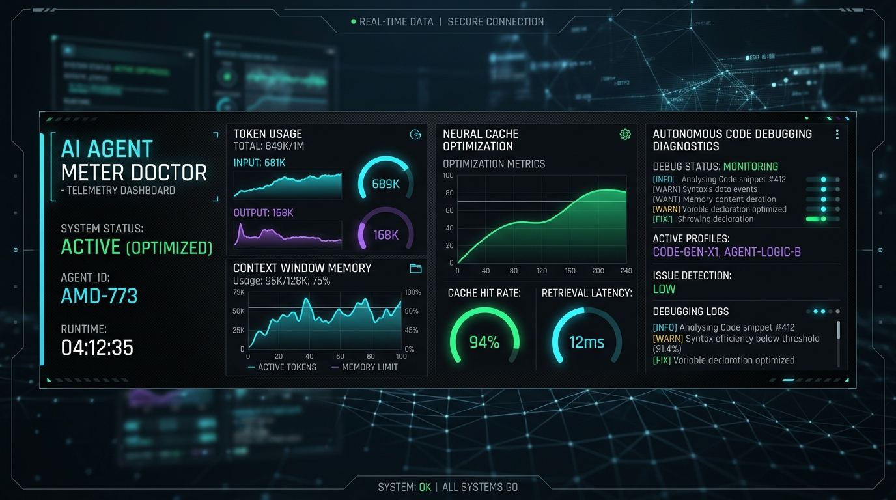
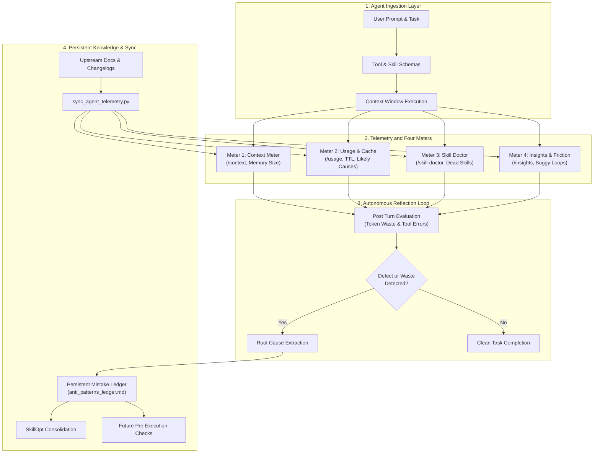
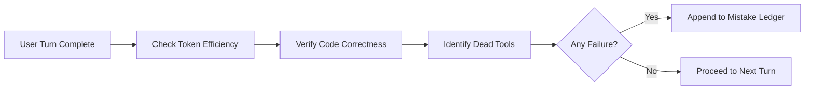

<div align="center">

# Agent Meter Doctor

### Universal AI Agent Telemetry, Token Waste Auditing, and Autonomous Self Improvement Engine

[](LICENSE)
[](https://python.org)
[](https://github.com)
[](https://github.com)
[](memory/anti_patterns_ledger.md)

<p align="center">
  <a href="#core-problem-and-value-proposition">Problem</a> •
  <a href="#system-architecture">Architecture</a> •
  <a href="#the-four-meters">The Four Meters</a> •
  <a href="#cross-agent-telemetry">Cross Agent Support</a> •
  <a href="#autonomous-learning-loop">Learning Loop</a> •
  <a href="#quick-start-guide">Quick Start</a>
</p>



</div>

---

## Core Problem and Value Proposition

Modern autonomous AI agents consume thousands of tokens on hidden overhead without delivering proportional value. Context windows silently bloat with uninvoked skill instructions, mid session tool additions trigger severe cache invalidation penalties, unverified file emissions generate repetitive error loops, and agents repeat identical mistakes across sessions.

> [!IMPORTANT]
> Agent Meter Doctor solves these structural inefficiencies. It bridges Claude Code native meters (`/context`, `/usage`, `/skill-doctor`, `/insights`) into a universal telemetry and self reflection standard applicable to all AI agents, pairing real time diagnostics with a Hermes inspired persistent mistake ledger.

### What Agent Meter Doctor Solves

* Token Waste Elimination: Detects cache busting actions, runaway tool schemas, bloated memory files, and excessive chain of thought generation.
* Dead Component Eradication: Flags loaded skills and plugins that incur a per turn context tax while remaining completely dormant.
* Code Bug and Friction Reduction: Diagnoses failed tool executions, repeated prompt friction, and unverified file generation before bad code is committed.
* Continuous Cross Session Evolution: Integrates an autonomous post turn reflection loop that records hard prevention rules into a persistent anti pattern ledger.

---

## System Architecture

The diagram below illustrates how raw session telemetry flows into meter diagnostics, triggers post turn reflection, and updates persistent procedural memory.



---

## The Four Meters

| Meter Command | Diagnostic Focus | Critical Signals | Immediate Remediation |
| :--- | :--- | :--- | :--- |
| **`/context`** | Memory Window Distribution | Memory files over 200 lines, heavy tool schemas | Trim `CLAUDE.md`, run `/compact`, run `/clear` |
| **`/usage`** | Token Attribution and Cache | Cache miss likely cause, scheduled loop costs | Lock tools at start, prune heavy MCP servers |
| **`/skill-doctor`** | Dormant Skill Identification | Loaded skills never invoked, per turn token tax | Deactivate dormant skills at named source paths |
| **`/insights`** | Session Friction and Bug Loops | Repeated prompt turns, failed code generation | Add targeted rules to memory, build custom skills |

---

## Cross Agent Telemetry

Agent Meter Doctor operates across the full landscape of modern AI coding assistants:

* **Claude Code**: Native command meters (`/context`, `/usage`, `/skill-doctor`, `/insights`), prompt cache cause hints (v2.1.260+), HTML reports.
* **Google Antigravity**: Inspects `transcript.jsonl` for step execution errors, chain of thought ratios, and background subagent state.
* **Cursor IDE**: Tracks Admin Events API, usage dashboard meters, and prevents `@Codebase` context inflation via `.cursorignore`.
* **Windsurf**: Audits Cascade memories, editor buffer injection overhead, and AI gateway proxy attribution.
* **Roo Code**: Monitors AI Inference Summary cards, checkpoint rollbacks, and mode specific token budgets.
* **Aider**: Leverages `/tokens`, `/lint`, and `/test` to enforce verified execution.
* **OpenAI Codex**: Audits completion metadata, enforces strict tool JSON schemas, and prevents repetitive infilling loops.
* **Hermes Agent**: Adapts episodic and procedural memory structures to prevent recurring errors.
* **Unlisted & Custom Agents**: Employs stdout/stderr stream sniffing, four character token estimation heuristics, and markdown memory interoperability.

---

## Autonomous Learning Loop

Every AI agent automatically reflects after each interaction:



Documented mistakes are stored in `memory/anti_patterns_ledger.md` with explicit prevention rules, ensuring the entire fleet of AI agents continuously evolves.

---

## Quick Start Guide

### Prerequisites
* Python 3.10 or later
* Access to `F:\Agent Skills`

### 1. Audit Current Session
Analyze an active conversation transcript to discover token waste, failed tools, and dead skills:
```bash
python scripts/audit_session.py "<path_to_transcript.jsonl>"

# With TypeSafe Jev semantic friction and dormant skill classification
python scripts/audit_session.py "<path_to_transcript.jsonl>" --use-jev
```

### 2. Prune Inactive Tool Context
Evaluate tool calls against the final response to safely prune redundant calls from context:
```bash
python scripts/prune_session.py "<path_to_transcript.jsonl>"
```

### 3. Search Documented Anti Patterns
Query the persistent mistake ledger before executing high risk changes:
```bash
python scripts/reflect_and_learn.py search "cache invalidation"
```

### 4. Log a Discovered Mistake
Record an error or tool failure with automatic category classification and deduplication:
```bash
python scripts/reflect_and_learn.py log \
  --title "Unverified Regex Replacement" \
  --failure "Applied global regex without line boundaries causing syntax errors" \
  --cause "Omitted unit test execution prior to returning" \
  --rule "Always run python test suite after modifying string parsers"
```

### 5. Synchronize Telemetry with Upstream Docs
Audit and update telemetry endpoints against official agent releases:
```bash
python scripts/sync_agent_telemetry.py
```

---

## Repository Structure

```text
agent-meter-doctor/
├── assets/
│   └── banner.png                # High resolution visual telemetry banner
├── memory/
│   └── anti_patterns_ledger.md   # Persistent Hermes style mistake registry
├── references/
│   ├── meters_reference.md       # Complete Claude Code four meters reference
│   ├── sync_status.json          # Cached upstream telemetry signatures
│   └── universal_telemetry.md    # Multi agent telemetry and observability guide
├── scripts/
│   ├── audit_session.py          # Session log parser and health auditor
│   ├── jev_definitions.py        # TypeSafe Jev prompt instructions and thresholds
│   ├── jev_service.py            # Jev System One client and fallback wrapper
│   ├── prune_session.py          # Context aware tool call pruning CLI
│   ├── reflect_and_learn.py      # Post turn reflection and ledger CLI
│   └── sync_agent_telemetry.py   # Upstream documentation synchronizer
├── .env.example                  # Environment configuration template
├── .gitignore                    # Local secrets and cache exclusions
├── AGENT_USAGE.md                # Agent operational guide
├── README.md                     # High end documentation standard
└── SKILL.md                      # Root skill specification and triggers
```

---

## Citations and References

* **Anthropic Documentation**: Official specifications and changelogs for Claude Code (`code.claude.com/docs/en/costs`, `code.claude.com/docs/en/commands`, `code.claude.com/docs/en/changelog`).
* **Implicator**: Industry analysis and architectural breakdown of `/skill-doctor` and context token tax (`implicator.ai`, September 2026).

