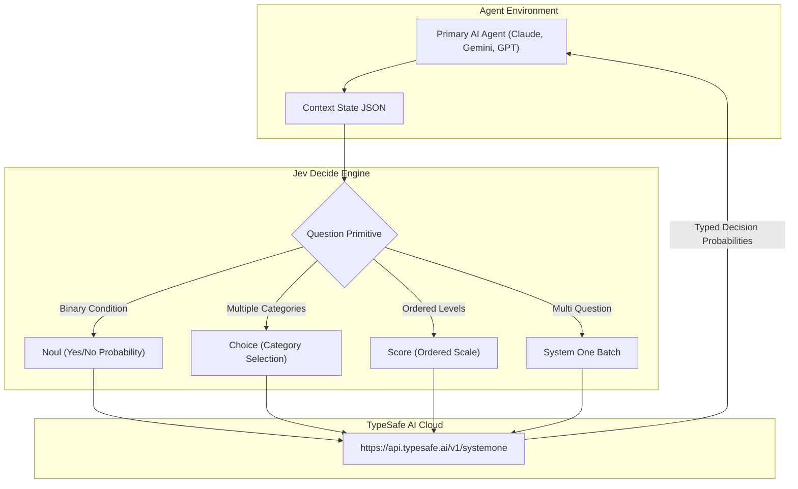

<div align="center">

# Jev Decide

### Sub Second Typed Decision Primitive Powered by TypeSafe AI

[](https://python.org)
[](https://typesafe.ai)
[](https://typesafe.ai)
[](LICENSE)

<p align="center">
  <a href="#core-problem-and-value">Problem & Value</a> •
  <a href="#architecture">Architecture</a> •
  <a href="#decision-primitives">Primitives</a> •
  <a href="#quick-start">Quick Start</a> •
  <a href="#security-and-credentials">Security</a>
</p>

</div>

---

## Core Problem and Value

Standard Large Language Models generate fluent prose, but spending a 4000 token completion to make a binary yes or no judgment or pick one item from a list burns significant compute and adds several seconds of latency. Furthermore, developers often rely on fragile regular expressions or brittle if/else chains to avoid expensive model calls.

> [!NOTE]
> Jev from TypeSafe AI is an ultra fast non generative model. It cannot generate prose, text, or code. It takes situational context and typed questions, returning exact mathematical probabilities in under a second.

### Why Jev Decide?

* **Sub Second Speed**: Evaluate conditions, categories, or scores in 200 to 400 milliseconds.
* **Token Efficiency**: Consumes zero generation tokens, saving up to 90% in inference costs.
* **Deterministic Fallback**: If offline or unconfigured, it gracefully falls back without crashing agent loops.
* **Cross Agent Compatibility**: Works across Antigravity, Claude Code, Cursor, Windsurf, and Claude.ai.

---

## Architecture



---

## Decision Primitives

| Primitive | Function | Description | Output Structure |
| :--- | :--- | :--- | :--- |
| **Noul** | `ask_yes_no(question, state)` | Probability that a condition is met | `{"probability": 0.88}` |
| **Choice** | `ask_choice(question, options, state)` | Selects winning category from discrete map | `{"choice": "billing", "probabilities": {...}}` |
| **Score** | `ask_score(question, levels, state)` | Positions state on an ordered progression | `{"score": "high", "probabilities": {...}}` |
| **Batch** | `ask_batch(questions, state)` | Parallel batched System One questions | `{q1: JevAnswer, q2: JevAnswer}` |

---

## Quick Start

### 1. Installation

```bash
pip install typesafe-sdk python-dotenv
```

### 2. Environment Configuration

Set the environment variable or create `.env`:

```powershell
$env:TYPESAFE_API_KEY = "your_key_here"
```

### 3. Verification Command

```powershell
python "F:\Agent Skills\jev-decide\scripts\jev_decide.py" yes_no "Is this action safe to run?" --state '{"action": "git status"}'
```

---

## Security and Credentials

> [!IMPORTANT]
> The API key is read dynamically at call time from `TYPESAFE_API_KEY` or local `.env` files. It is never logged, never echoed to chat or markdown outputs, and never committed to version control.
